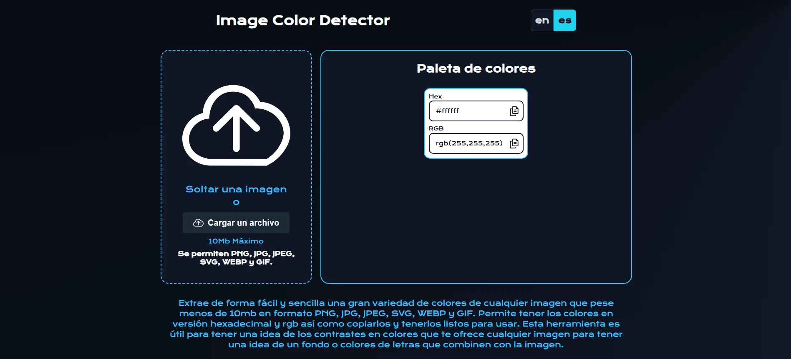

[](https://github.com/Reyes1921/image-color-detector/blob/main/README.md)
[](https://github.com/Reyes1921/image-color-detector/blob/main/README.es.md)

# Image Color Detector

Extrae de forma fácil y sencilla una gran variedad de colores de cualquier imagen que pese menos de 10mb en formato PNG, JPG, JPEG, SVG, WEBP y GIF. Permite tener los colores en versión hexadecimal y rgb así como copiarlos y tenerlos listos para usar. Take a look [image-color-detector](https://image-color-detector.vercel.app/)

## ⚙️ Funciones

- Extrae una variedad de colores de cualquier imagen que ocupe menos de 10mb

- Admite los formatos PNG, JPG, JPEG, SVG, WEBP y GIF

## 👨‍💻 Tecnologías utilizadas

- [**React 18**](https://react.dev/) - La biblioteca para interfaces de usuario nativas y web.
- [**TypeScript**](https://www.typescriptlang.org/) - TypeScript es un lenguaje de programación fuertemente tipado que se basa en JavaScript.
- [**Tailwindcss**](https://tailwindcss.com/) - Framework de CSS para el diseño de páginas web.
- [**Extract Colors**](https://www.npmjs.com/package/extract-colors/) - Extraer paletas de colores de imágenes.
- [**Prettier**](https://prettier.io/) + [prettier-plugin-tailwindcss](https://github.com/tailwindlabs/prettier-plugin-tailwindcss) - Formateador CSS.
- [**Pragmatic drag and drop**](https://atlassian.design/components/pragmatic-drag-and-drop/about) Arrastrar y soltar flexible y rápido para cualquier experiencia en cualquier pila tecnológica.
- [**i18next**](https://www.i18next.com/) i18next es un marco de internacionalización escrito en y para JavaScript.
- [**Primereact**](https://primereact.org/) La suite de interfaz de usuario más completa para React.js.

## 🚀 Primeros pasos

En primer lugar, ejecute el servidor de desarrollo:

```bash
npm install
npm run dev
```


<div align="center">


</div>

# ✉️ Contacto

- Correo electrónico: reyesjrondon@gmail.com
- [Portafolio](https://www.reyesrondon.dev/es)
- [Linkedin](https://www.linkedin.com/in/reyes-rondon/)
