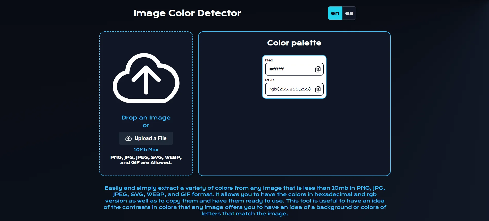

[](https://github.com/Reyes1921/image-color-detector/blob/main/README.md)
[](https://github.com/Reyes1921/image-color-detector/blob/main/README.es.md)

# Image Color Detector

Easily and simply extract a variety of colors from any image that is less than 10mb in PNG, JPG, JPEG, SVG, WEBP, and GIF format. It allows you to have the colors in hexadecimal and rgb version as well as to copy them and have them ready to use. Take a look [image-color-detector](https://image-color-detector.vercel.app/)

## ⚙️ Features

- Extracts a variety of colors from any image that is less than 10mb

- PNG, JPG, JPEG, SVG, WEBP, and GIF format allowed

## 👨‍💻 Technologies used

- [**React 18**](https://react.dev/) - The library for web and native user interfaces.
- [**TypeScript**](https://www.typescriptlang.org/) - TypeScript is a strongly typed programming language that builds on JavaScript.
- [**Tailwindcss**](https://tailwindcss.com/) - A utility-first CSS framework.
- [**Extract Colors**](https://www.npmjs.com/package/extract-colors/) - Extract color palettes from images.
- [**Prettier**](https://prettier.io/) + [prettier-plugin-tailwindcss](https://github.com/tailwindlabs/prettier-plugin-tailwindcss) - CSS formatter.
- [**Pragmatic drag and drop**](https://atlassian.design/components/pragmatic-drag-and-drop/about/) Flexible and fast drag and drop for any experience on any tech stack.
- [**i18next**](https://www.i18next.com/) i18next is an internationalization-framework written in and for JavaScript.
- [**Primereact**](https://primereact.org/) The Most Complete UI Suite for React.js.

## 🚀 Getting Started

First, run the development server:

```bash
npm install
npm run dev
```


<div align="center">


</div>

# Contact

- E-mail address: reyesjrondon@gmail.com
- [Portfolio](https://www.reyesrondon.dev/en)
- [Linkedin](https://www.linkedin.com/in/reyes-rondon/?locale=en_US)
